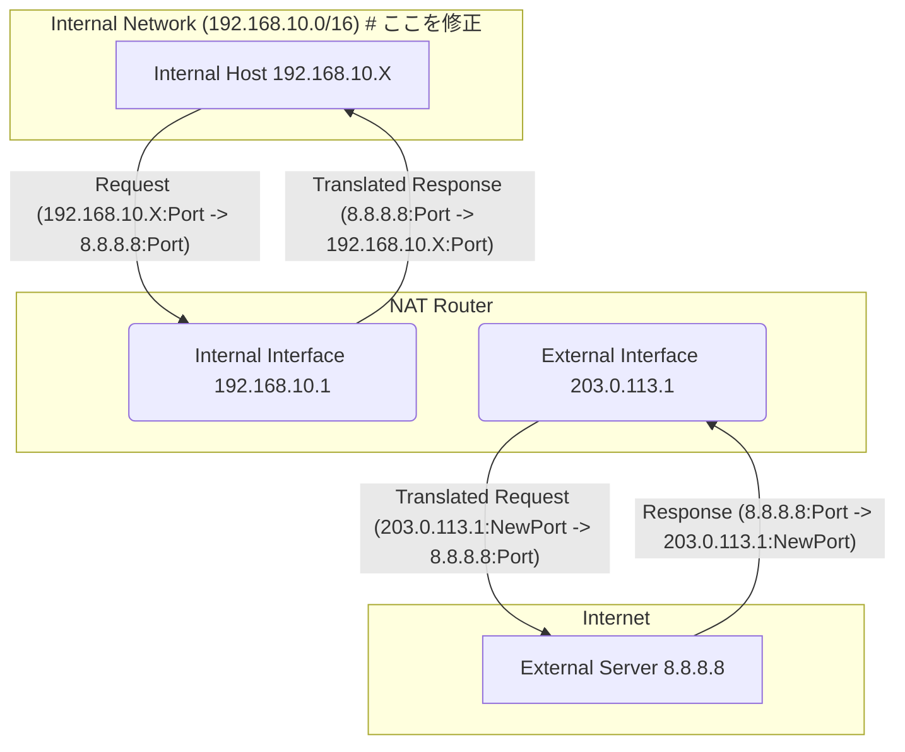

# NAT シミュレーター

これは、Network Address Translation (NAT) の動作をシミュレートするシンプルなTUI (Text-based User Interface) アプリケーションです。内部ネットワークからの通信がどのようにNATデバイスによって外部ネットワークへ変換され、そのエントリがどのように管理されるかを視覚的に確認できます。

なお、NATテーブルエントリは通常300秒以上のTTLのようですが、シミュレーションのためにTTLを30秒に設定しています。これにより、エントリの追加や削除の動作を短時間で確認できます。

```html
<script src="https://asciinema.org/a/bJMOlPe5F4mFLY0Rl6fiJSOp3.js?autoplay=1" id="asciicast-bJMOlPe5F4mFLY0Rl6fiJSOp3" async></script>
```


## 想定するネットワーク構成



## これは何か

本シミュレーターは、以下の機能を備えています。

*   **TUI表示**: `textual` ライブラリを使用したテキストベースのユーザーインターフェースで、NATテーブルの状態をリアルタイムに表示します。
*   **NATテーブル管理**: SQLite3データベースを使用してNATエントリを永続化します。エントリには内部送信元IP/ポート、宛先IP/ポート、外部送信元IP/ポート、およびTTL (Time To Live) が含まれます。
*   **通信シミュレーション**: 
    *   ユーザーが宛先IPアドレスとポートを入力することで、手動でNAT変換をトリガーできます。
    *   バックグラウンドでランダムな内部ホストからの通信が自動的に生成され、NATテーブルにエントリが追加・更新されます。
    *   既存の通信が継続している場合、対応するNATエントリのTTLがリフレッシュされます。
*   **TTL管理**: エントリのTTLは1秒ごとに減少し、TTLが0になったエントリは自動的に削除されます。TTLが短いエントリは赤色、リフレッシュされたエントリは緑色で表示され、視覚的なフィードバックを提供します。

## 起動方法

本シミュレーターはPythonで記述されており、`uv` を使用して依存関係を管理しています。

1.  **`uv` のインストール**:
    `uv` がインストールされていない場合は、[uvの公式サイト](https://docs.astral.sh/uv/) を参照してインストールしてください。

2.  **プロジェクトの初期化と依存関係のインストール**:
    プロジェクトのルートディレクトリで以下のコマンドを実行します。

    ```bash
    uv init
    uv add textual
    ```

3.  **NATテーブルの初期化**:
    シミュレーターを初めて起動する前、またはNATテーブルをリセットしたい場合は、以下のコマンドを実行します。

    ```bash
    uv run python main.py --init
    ```

4.  **シミュレーターの起動**:
    以下のコマンドでシミュレーターを起動します。

    ```bash
    uv run python main.py
    ```

## 基本的な使い方

シミュレーターが起動すると、TUIが表示されます。

*   **宛先IP:ポートの入力**: 画面下部の入力フィールドに、通信したい宛先のIPアドレスとポートを `IPアドレス:ポート番号` の形式で入力し、`Enter` キーを押してください (例: `8.8.8.8:53`)。
*   **NATテーブル**: 画面上部のテーブルに、NATエントリが表示されます。
    *   `Internal Src IP`: 内部ネットワークの送信元IPアドレス (シミュレーターが自動生成または固定)
    *   `Internal Src Port`: 内部ネットワークの送信元ポート (シミュレーターが自動生成)
    *   `Dest IP`: 宛先IPアドレス
    *   `Dest Port`: 宛先ポート
    *   `External Src IP`: NATデバイスの外部IPアドレス (固定: `203.0.113.1`)
    *   `External Src Port`: NATデバイスが割り当てた外部ポート
    *   `TTL`: エントリの残り寿命 (秒)。TTLがリフレッシュされると緑色、残り少ないと赤色で表示されます。
*   **通知**: 画面右下には、新しいNATエントリの追加や期限切れエントリの削除に関する通知が表示されます。
*   **ダークモードの切り替え**: `d` キーを押すと、ダークモードとライトモードを切り替えられます。
*   **終了**: `q` キーを押すと、アプリケーションを終了します。

# ライセンス

こちらのコードは、**GPL v3**として公開します。

このプロジェクトは [GNU General Public License v3.0](https://www.gnu.org/licenses/gpl-3.0.html) のもとで公開されています。詳細は `LICENSE` ファイルをご覧ください。

と思ったのですが、なぜか今www.gnu.orgに繋がらないので後ほど追加する予定です。

# お願い

もしこのコードやツールが使えそう、どこかで使いたいというときは、ぜひご連絡ください。 **もしよければGitHubのスターをつけていただけると嬉しいです**。
